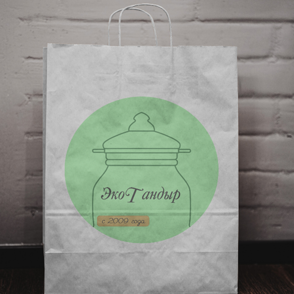
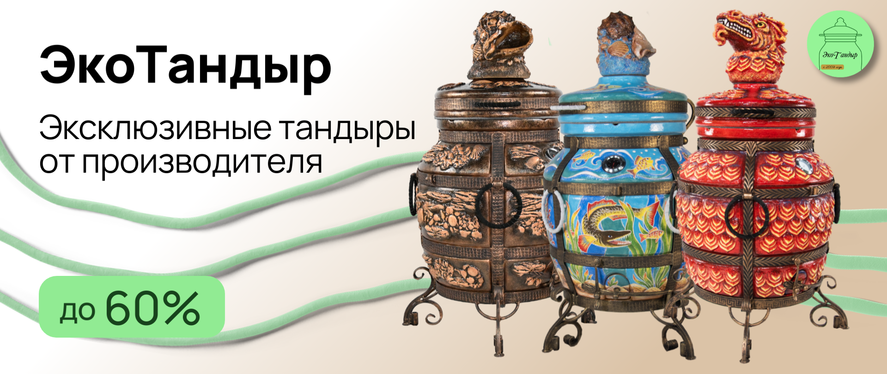
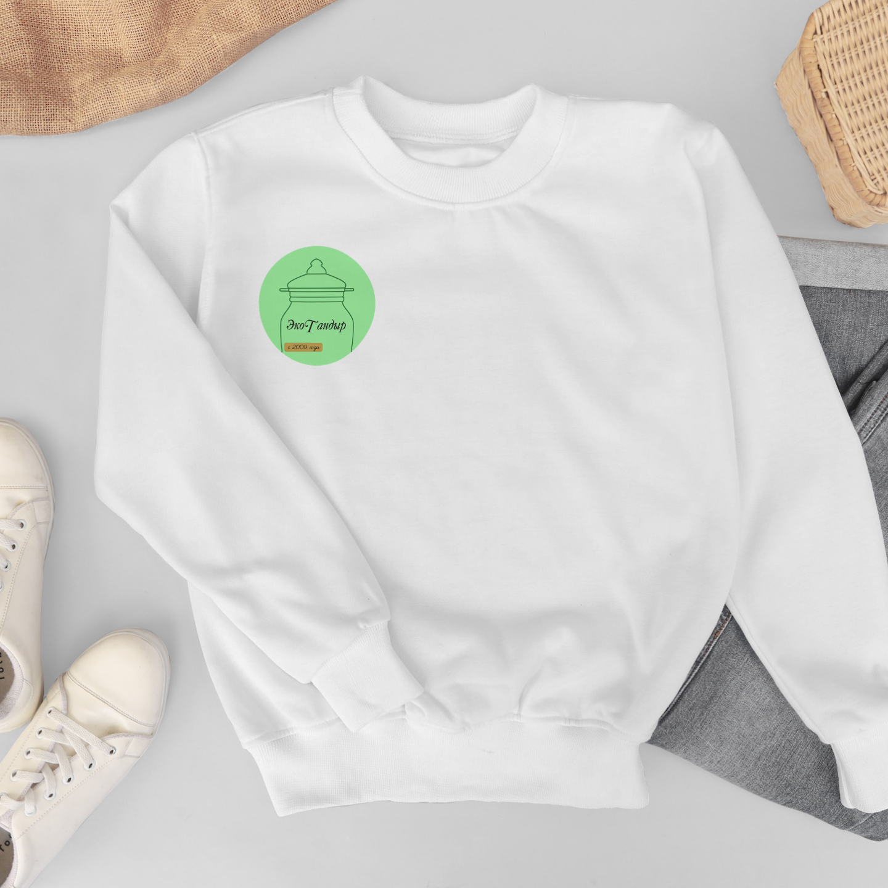

# Фирменный стиль и рекламное оформление — [Название организации]

## Введение
Это проект фирменного стиля для [Название организации]. Здесь показаны логотип, фирменные цвета, визитка, пакет, баннер и толстовка (мерч).  

---

## Логотип
  
*Это логотип компании. Используется на всех носителях.*

---

## Визитка
  
*Визитка с логотипом и контактной информацией.*

---

## Пакет / упаковка
  
*Фирменный пакет с логотипом и цветами компании.*

---

## Баннер
  
*Рекламный баннер для соцсетей и сайта.*

---

## Мерч (Толстовка)
  
*Толстовка с логотипом компании.*

---

## Заключение
Проект показывает, как фирменный стиль используется на всех элементах: от визиток и баннеров до мерча.
